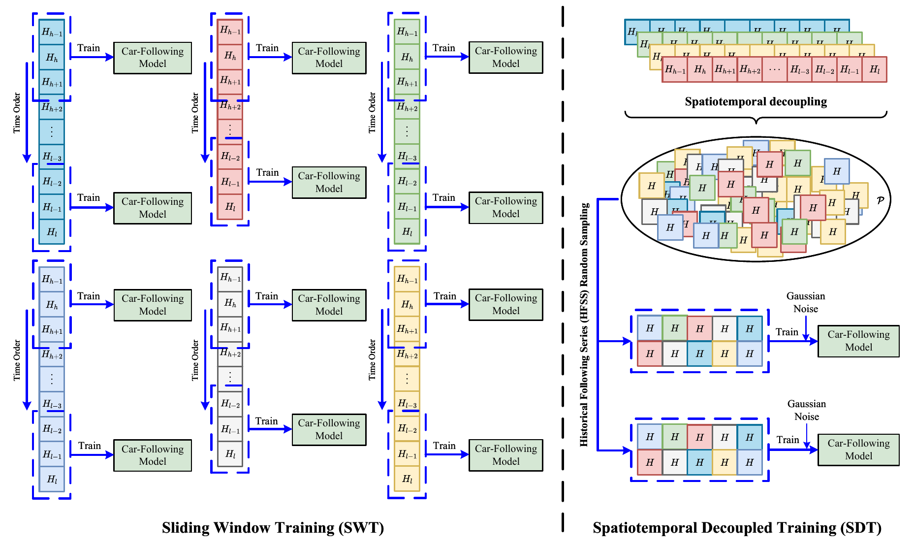
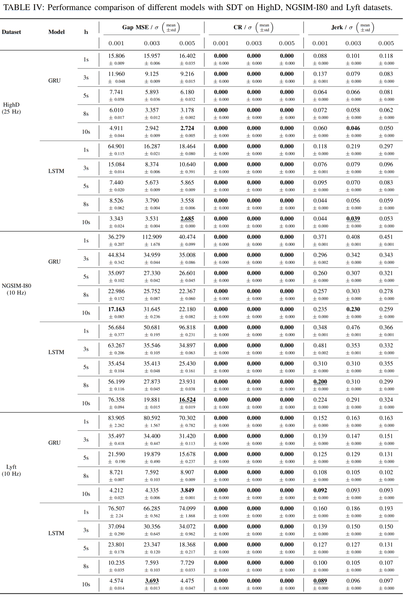

# Spatiotemporal-Decoupled Training: Enhancing Car-Following Behavior Modeling with Cross-Spatiotemporal Generalization



## 1. Environment
  - Python 3.9 is required.
  - Install dependencies listed in requirements.txt:
    - `pip install -r requirements.txt`

## 2. Datasets
  - The datasets are hosted on [Google Drive](https://drive.google.com/file/d/1XDldCBtzTQ3wK9hZOBOqs7bwdZUEjIr2/view?usp=drive_link).
  - Use the provided download link to obtain the datasets and place them under the designated project directory.


## 3. Dataset preprocessing
  - The downloaded data is stored in a trajectory-wise format.
  - For SDT training, run the preprocessing script:
```shell 
python -m utils.split_dataset.py --type=train --dataset_name=highd --save_path=/path/to/save_sdt_dataset.path --split_data_path=/path/to/download_dataset.npy --history_windows_length=25 --time_step=0.04
```

## 4. Train

### 4.1 SDT
1. trian lstm
```shell
python train.py --cfg=./config/lstm.yaml --hyp=./config/hyp.yaml --dataset_path=/path/to/your/dataset --val_dataset_path=/path/to/dataset --history_windows_length=25 --name=train1 --device cuda:0 --linear_normal True --batch_size 64 --epochs 100 --noise 0.001 
```
2. trian gru
```shell
python train.py --cfg=./config/gru.yaml --hyp=./config/hyp.yaml --dataset_path=/path/to/your/dataset --val_dataset_path=/path/to/ngsim/dataset --history_windows_length=25 --name=train1 --device cuda:0 --linear_normal True --batch_size 64 --epochs 100 --noise 0.001 --tsi 1
```

### 4.2 SWT
1. trian lstm
```shell
python train.py --cfg ./config/lstm.yaml --hyp ./config/hyp.yaml --dataset_path /path/to/your/dataset --val_dataset_path /path/to/dataset --history_windows_length 25 --name train_lstm --device cuda:0 --linear_normal True --batch_size 64 --epochs 100 --noise 0.001 --tsi 0 
```
2. trian gru
```shell
python train.py --cfg ./config/gru.yaml --hyp ./config/hyp.yaml --dataset_path /path/to/your/dataset --val_dataset_path /path/to/ngsim/dataset --history_windows_length 25 --name train_gru --device cuda:0 --linear_normal True --batch_size 64 --epochs 100 --noise 0.001 --tsi 0
```


# 5. Test

|  Dataset  |    HighD    | NGSIM-I80 |   Lyft    |
| :-------: | :---------: | :-------: | :-------: |
| time step | 0.04 (25Hz) | 0.1(10Hz) | 0.1(10Hz) |

1. test lstm

```shell
python test.py --weights /path/to/pth --cfg ./config/lstm.yaml --history_windows_length 25 --dateset_path /path/to/test/dataset --linear_normal True --name test_lstm --device cuda:0 --time_step 0.04
```

2. test gru

```shell
python test.py --weights /path/to/pth --cfg ./config/gru.yaml --history_windows_length 25 --dateset_path /path/to/test/dataset --linear_normal True --name test_gru --device cuda:0 --time_step 0.04
```

# 6. CheckPoint
The checkpoints are hosted on [Google Drive](https://drive.google.com/file/d/1bpExRiesjT1_MHPShR829IkNWPU67KhT/view?usp=sharing).


# 7. Result



